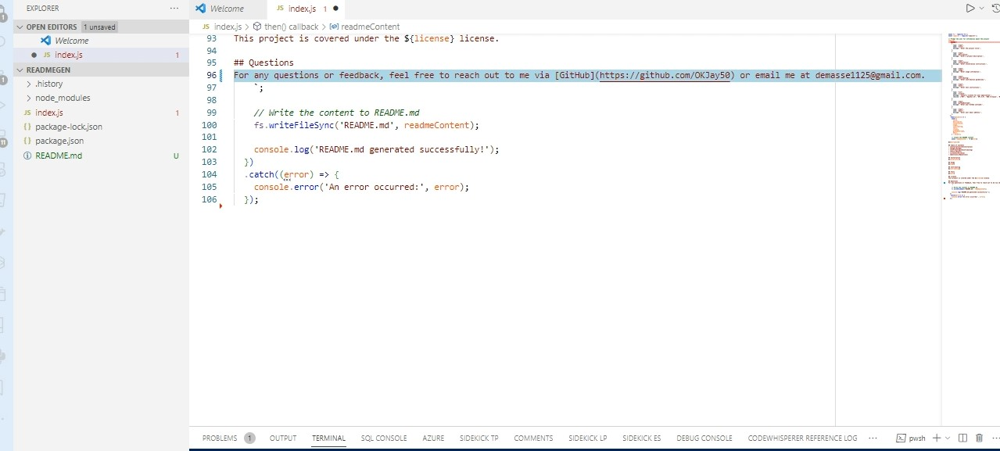

# readmegen

this is a readme generator 

## Table of Contents
- [Installation](#installation)
- [Usage](#usage)
- [Contributing](#contributing)
- [Tests](#tests)
- [License](#license)
- [Questions](#questions)

## Installation

* node index.js

## Usage

## License
This project is covered under the MIT license.

## Questions
For any questions or feedback, feel free to reach out to me via [GitHub](https://github.com/OKJay50) or email me at demasse1125@gmail.com.
    
